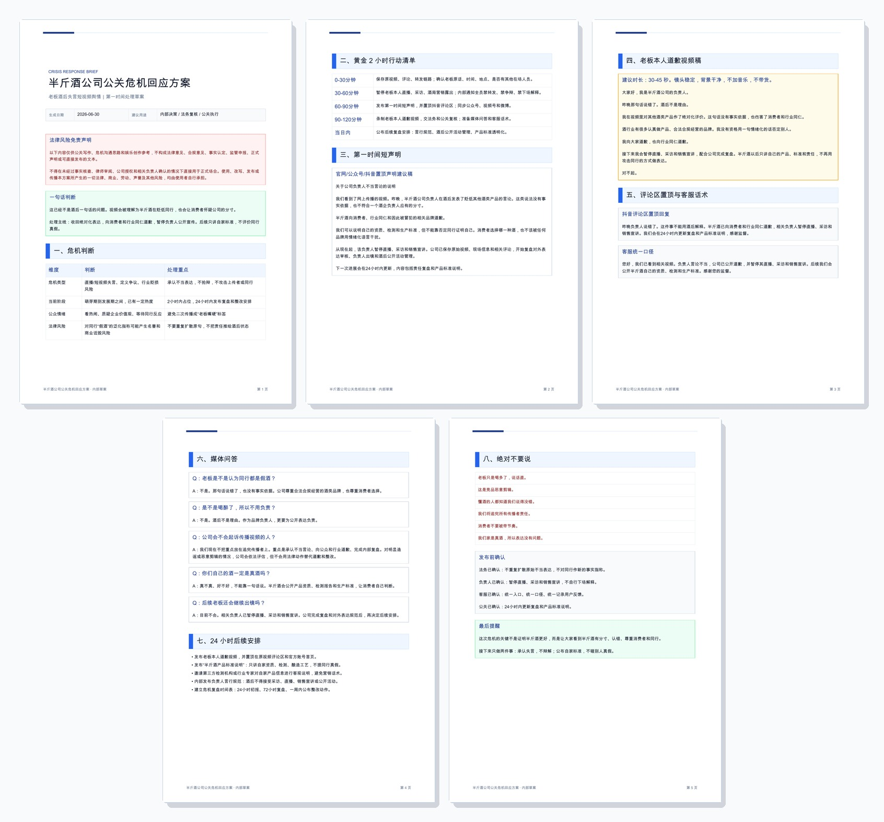
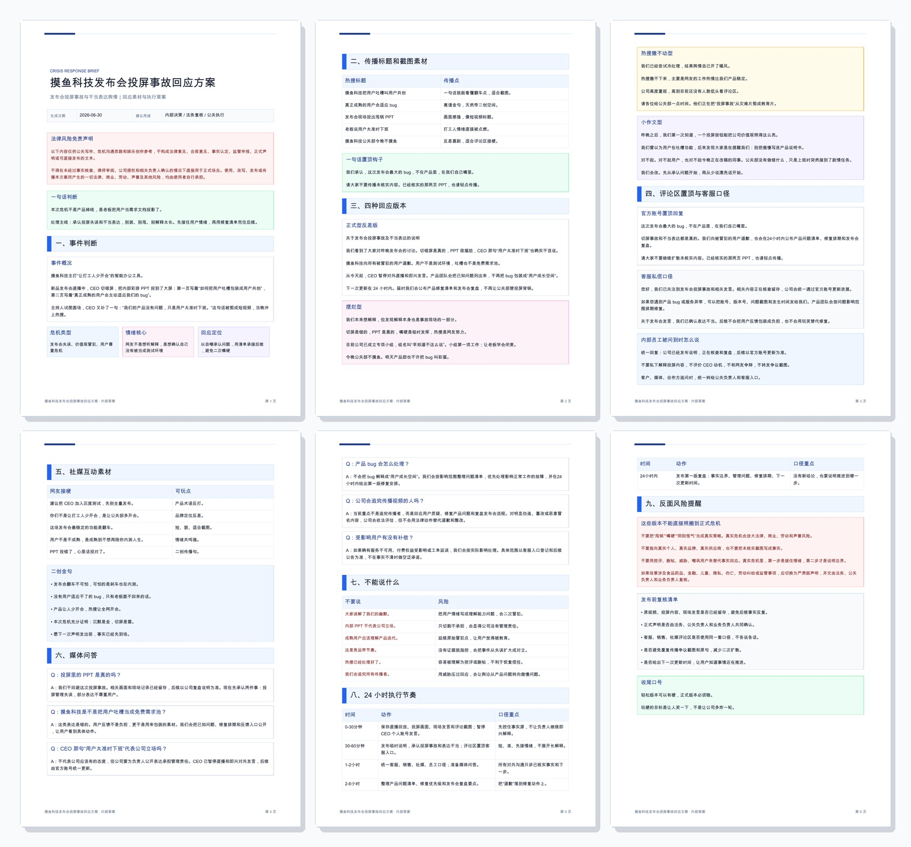

# Crisis PR Response - 公关危机回应声明技能


[安装](#安装) · [案例预览](#案例预览) · [更新记录](#更新记录) · [免责声明](#免责声明) · [开源授权](#开源授权)

**公关危机一出现，先别嘴硬，先把事实、歉意、行动和法律风险边界写清楚。**

Crisis PR Response 是一个中文优先的 Codex 技能，用于在品牌、公司、机构、项目、团队或公众人物遭遇公关危机时，生成带法律风险免责声明的第一时间回应声明、媒体问答、客服口径、内部说明、执行节奏和 PDF 简报。

它可以处理食品安全、产品事故、数据泄露、直播失言、客服辱骂、文化冒犯、劳资争议、创始人回应失当、舆论反转、供应链和经营受损等场景。即使用户要求玩梗或娱乐版本，也会按“可能被真实参考”的标准保留事实边界、信息完整性和风险提示。

> [!IMPORTANT]
> **法律风险免责声明：本项目仅供公关写作、危机沟通思路、内部演练和娱乐创作参考，不构成法律意见、合规意见、事实认定、监管申报、正式声明或可直接发布的文本。**
>
> 不得在未经过事实核查、律师审阅、公司授权和相关负责人确认的情况下直接用于正式场合。真实公关危机请保留证据、暂停风险源、确认事实边界，并由法务、公关负责人和业务负责人共同复核。使用、改写、发布或传播本项目生成内容所产生的一切法律、商业、劳动、声誉及其他风险，均由使用者自行承担。

## 核心能力

- **第一时间声明**：正式型、悔过型、事实核查型、进展通报型、CEO道歉型、内部信型。
- **媒体问答**：围绕事实、责任、赔偿、后续动作、法律边界生成可复核问答。
- **社媒和客服口径**：评论区置顶、客服私信、员工被问到时怎么说。
- **风险禁区**：列出不能说什么，避免二次引爆。
- **经营影响判断**：兼顾消费者、自身经营、供应商、渠道、现金流和长期品牌价值。
- **娱乐风格**：摆烂型、死不承认型、甩锅型、小作文型、热搜撤不动型等，仅用于讽刺、演练或反面示例。
- **PDF 简报**：默认可生成“危机指挥简报”式 PDF，包含免责声明、事件判断、声明稿、问答、禁区、执行节奏和发布前复核。

## 示例提示词

```text
使用 $crisis-pr-response 为一次真实公关危机写三版回应声明。
事件：连锁餐饮品牌被质疑门店使用半成品却长期宣传现做。
要求：正式型、悔过型、进展通报型；必须包含法律风险免责声明、已核实事实、正在核查事项、整改时间表和消费者联络入口。
```

娱乐演练示例：

```text
使用 $crisis-pr-response 写一个轻松自嘲版公关回应。
事件：品牌官号把内部吐槽误发到微博。
要求：有传播性，但必须保留事实边界、不能说什么、媒体问答和发布前复核。
```

## 案例预览

下面是本项目生成的原创演练案例，用于展示输出结构和 PDF 排版效果。案例内容仅供写作、演练和展示，不构成事实认定、法律意见、监管意见或可直接发布的正式声明。

### 案例一：半斤酒公司酒后失言舆情

重点摘要：

- **危机类型**：负责人酒后公开失言、行业贬损风险、消费者信任受损。
- **回应主线**：不把酒后当理由，不攻击传播者，不评价同行真假；先承认不当表达，再公开自家产品标准。
- **信息覆盖**：危机判断、黄金 2 小时行动清单、第一时间短声明、负责人道歉视频稿、评论区置顶、客服口径、媒体问答、24 小时后续安排、绝对不要说。
- **风险边界**：避免商业诋毁、避免二次扩散原句、避免用法务动作替代道歉和整改。

<p>
  
</p>

### 案例二：摸鱼科技发布会投屏事故

重点摘要：

- **危机类型**：发布会投屏事故、负责人不当表达、用户尊重危机、产品信任风险。
- **回应主线**：承认投屏失误和表达不当，停止嘴硬和长篇解释，先接住用户情绪，再给修复清单和下一次更新时间。
- **信息覆盖**：事件判断、传播标题、四种回应版本、评论区置顶、客服私信口径、内部员工口径、社媒互动素材、媒体问答、不能说什么、24 小时执行节奏、发布前复核。
- **风险边界**：娱乐表达不能替代事实核查；不把用户吐槽写成理解能力问题，不用威胁、控评或甩锅压过回应。

<p>
  
</p>

## 安装

把技能文件夹复制到 Codex 技能目录：

```bash
cp -R crisis-pr-response ~/.codex/skills/
```

然后这样调用：

```text
使用 $crisis-pr-response 为一次品牌热搜危机写三版带免责声明的回应声明，并输出 PDF。
```

## 输出原则

- 不管是正式需求、内部演练还是玩梗，都默认产物可能被拿去做真实公关参考。
- 事实、推测、建议、娱乐版本和反面示例必须分开写。
- 缺少关键事实时，先写临时持有声明或待核查清单，不编造调查结论。
- PDF 不能只给段子，必须覆盖事件判断、对外短声明、评论区置顶、客服口径、媒体问答、不能说什么、执行节奏和发布前复核。
- 不为了短期平息舆论牺牲长期品牌价值、供应链伙伴、消费者权益或经营连续性。

## 更新记录

### 2026-06-30

- 新增案例预览：半斤酒公司酒后失言舆情、摸鱼科技发布会投屏事故。
- 新增两张完整案例拼图，展示 PDF 的信息覆盖和排版效果。
- 强化 PDF 输出规则：无论正式需求还是玩梗演练，都必须保证信息完整性、事实边界和风险提示。
- 补充公关材料信息面：评论区置顶、客服口径、媒体问答、不能说什么、24 小时执行节奏、发布前复核。

## 免责声明

本项目用于公关写作、危机沟通、内部演练和娱乐创作，不构成法律意见、合规意见、事实认定、监管申报、正式声明或可直接发布的文本。真实公关危机请先止损、保留证据、确认事实，并交由法务、公关负责人和业务负责人共同复核。请勿把本项目当作逃避责任、伪造证据、威胁爆料者、控评删帖、甩锅他人或直接发布正式声明的工具。

## 开源授权

本项目基于 [MIT License](LICENSE) 开源。
